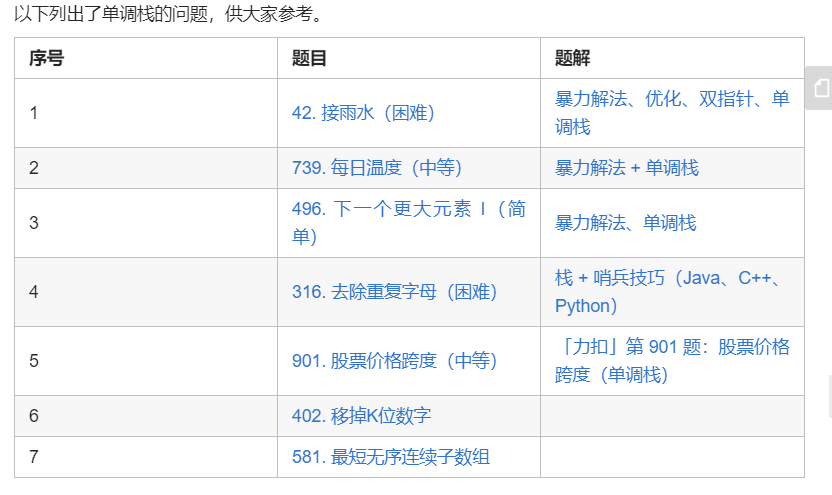

### SoftLeetCode

#### Todo
 - [x] 了解莫里斯遍历 https://www.cnblogs.com/AnnieKim/archive/2013/06/15/morristraversal.html
 - [x] 了解动态规划
 - [x] [回溯](https://leetcode-cn.com/problems/permutations/solution/hui-su-suan-fa-python-dai-ma-java-dai-ma-by-liweiw/)
 - [ ] 四数之和双指针法
 - [ ] LCP No.19 秋叶收藏集、分割等和子集 DP
 - [x] 二分查找 [一文带你搞定二分查找及其多个变种](https://leetcode-cn.com/problems/find-first-and-last-position-of-element-in-sorted-array/solution/yi-wen-dai-ni-gao-ding-er-fen-cha-zhao-j-ymwl/)[300. 最长递增子序列](https://leetcode-cn.com/problems/longest-increasing-subsequence/solution/zui-chang-shang-sheng-zi-xu-lie-by-leetcode-soluti/)
 - [ ] 快慢指针 https://leetcode-cn.com/problems/find-the-duplicate-number/solution/xun-zhao-zhong-fu-shu-by-leetcode-solution/
 - [ ] Manacher 算法 [最长回文子串](https://leetcode-cn.com/problems/longest-palindromic-substring/solution/zui-chang-hui-wen-zi-chuan-by-leetcode-solution/) [647. 回文子串](https://leetcode-cn.com/problems/palindromic-substrings/solution/hui-wen-zi-chuan-by-leetcode-solution/)
 - [ ] 滑动窗口 https://leetcode-cn.com/problems/longest-substring-without-repeating-characters/solution/hua-dong-chuang-kou-by-powcai/
 - [ ] 排序算法 [148. 排序链表](https://leetcode-cn.com/problems/sort-list/solution/pai-xu-lian-biao-by-leetcode-solution/)

#### 已完成


#### 已接触内容
数组、字符串 
<br>
链表、二叉树


#### 记录
No.141~142 检测环形链表<br>
1、双指针检测环形链表的环时，为什么慢指针入环第一圈没走完的时候就会和快指针相遇？
```
设 环的长度为A,慢指针在入环的时候快指针在环中的位置B(取值范围0到A-1),
当快慢指针相遇时 [慢指针在环中走了C] ,有
    C = ( B + 2C) % A,等价于 
    An + C = B + 2C,合并得
    C = An - B
    当 n=1 时 , 0 <= C < A
故 慢指针在第一圈必定能和快指针相遇
```
LCP No.19 秋叶收藏集<br>
2、DP思路。

No.416. 分割等和子集<br>
3、DP思路。

No.530. 二叉搜索树的最小绝对差<br>
4、中序遍历后恰好从小到大排列

No.24. 两两交换链表中的节点<br>
5、递归和迭代两种方法

No.116. 填充每个节点的下一个右侧节点指针<br>
6、可以迭代、递归、bfs。bfs由于使用队列空间复杂度较大，递归耗时最短，递归内存消耗较少。思路就是：同一父节点的两个子节点中左节点的next就是右节点，
而该右子节点的next就是该父节点的next的left，如果该父节点的next为null就进入到下一层的最左节点，继续如上操作。

No. 738. 单调递增的数字<br>
7、贪心： 遍历该数字，找到第一个N[i - 1] > N[i]，将此i - 1的数字若前面也有则全部-1，将i及其以后的数字全部置9

No. 714. 买卖股票的最佳时机含手续费<br>
8、dp[i][0]代表第i天过后不拥有股票时最大收入，dp[i][1]代表第i天过后拥有股票时最大收入
```cpp
       dp[i][0] = max(dp[i - 1][0], dp[i - 1][1] + prices[i] - fee);
       dp[i][1] = max(dp[i - 1][0] - prices[i], dp[i - 1][1]);
```

No. 10. 正则表达式匹配<br>
9、动态规划，这道题太难了。。。

No. 169. 多数元素<br>
10、摩尔投票法

22. 括号生成<br>
回溯 动态规划

1202. 交换字符串中的元素 <br>
并查集：https://zhuanlan.zhihu.com/p/93647900/
模板：
```cpp
    int* fa, *rank;
    void init_1202(int n) {
      for (int i = 0; i < n; i++) {
        fa[i] = i;
        rank[i] = 1;
      }
    }

    int find_1202(int x) {
        return x == fa[x] ? x : (fa[x] = find_1202(fa[x]));
    }

    void merge_1202(int i, int j) {
        //fa[find_1202(i)] = find_1202(j);
      int x = find_1202(i), y = find_1202(j);
      if (rank[x] <= rank[y])
        fa[x] = y;
      else
        fa[y] = x;
      if (rank[x] == rank[y] && x != y) rank[y]++;
    }
```
```cpp
    unordered_map<int, int> f, rank;
    int find(int x) {
        if (!f.count(x)) {
            f[x] = x;
            rank[x] = 1;
        }
        return f[x] == x ? x : f[x] = find(f[x]);
    }

    void unionSet(int x, int y) {
        int fx = find(x), fy = find(y);
        if (fx == fy) {
            return;
        }
        if (rank[fx] < rank[fy]) {
            swap(fx, fy);
        }
        rank[fx] += rank[fy];
        f[fy] = fx;
    }

    int numberOfConnectedComponent() {
        int num = 0;
        for (auto &[x, fa] : f) {
            if (x == fa) {
                num++;
            }
        }
        return num;
    }

```

739. 每日温度 <br>
单调栈 https://zhuanlan.zhihu.com/p/61423849 「力扣」第 42、739、496、316、901、402、581 题。

<br>模板：
```cpp
stack<int> mono_stk;
for (遍历数组)) {
    while (栈非空 && 栈顶元素大于当前元素) {
        更新结果;
        栈顶元素出栈;
    }
    入栈;
}
```

46. 全排列<br>
回溯

208. 实现 Trie (前缀树) [题目](https://leetcode-cn.com/problems/implement-trie-prefix-tree/solution/)<br>
前缀树实现，可以自动补全等
- 找到具有同一前缀的全部键值。
- 按词典序枚举字符串的数据集。
#### Trie 树是一个有根的树，其结点具有以下字段：。
- 最多 R 个指向子结点的链接，其中每个链接对应字母表数据集中的一个字母。
- 本文中假定 R 为 26，小写拉丁字母的数量。
- 布尔字段，以指定节点是对应键的结尾还是只是键前缀。


#### 2020.1.21 - 59 / 125
- [x] 1489. 找到最小生成树里的关键边和伪关键边
- [x] 337. 打家劫舍 III
- [x] 309. 最佳买卖股票时机含冷冻期
- [x] 300. 最长递增子序列


#### 2020.1.22 - 59 / 125
- [x] 989. 数组形式的整数加法 逐位扫描
- [x] 152. 乘积最大子数组  注意负数情况
- [x] 581. 最短无序连续子数组
- [ ] 221. 最大正方形 (后面完成)


#### 2020.1.24 - 70 / 139
- [x] 674. 最长连续递增序列 dp
- [x] 221. 最大正方形
- [x] 437. 路径总和 III
- [x] 560. 和为K的子数组 暴力超时  改用前缀
- [x] 55. 跳跃游戏 递归超时
- [x] 56. 合并区间
- [x] 78. 子集 回溯


#### 2020.1.25 - 71 / 139
- [x] 200. 岛屿数量 并查集
- [x] 959. 由斜杠划分区域
- [x] 79. 单词搜索
- [x] 236. 二叉树的最近公共祖先

#### 2020.1.26 - 78 / 150
- [x] 1128. 等价多米诺骨牌对的数量
- [x] 34. 在排序数组中查找元素的第一个和最后一个位置
- [x] 35. 搜索插入位置
- [x] 33. 搜索旋转排序数组
- [x] 96. 不同的二叉搜索树
- [x] 139. 单词拆分
- [x] 394. 字符串解码


#### 2020.1.27 - 81/ 155
- [x] 1579. 保证图可完全遍历
- [x] 240. 搜索二维矩阵 II
- [x] 208. 实现 Trie (前缀树)
- [x] 148. 排序链表


#### 2020.1.28 - 81/ 155
- [x] 724. 寻找数组的中心索引
- [x] 105. 从前序与中序遍历序列构造二叉树 哈希表存位置减少时间损耗
- [x] 114. 二叉树展开为链表 逆后序遍历

#### 2020.1.29 - 85/ 160
- [x] 1631. 最小体力消耗路径 并查集
- [x] 207. 课程表 拓扑排序
- [x] 98. 验证二叉搜索树 前序遍历 注意边界

